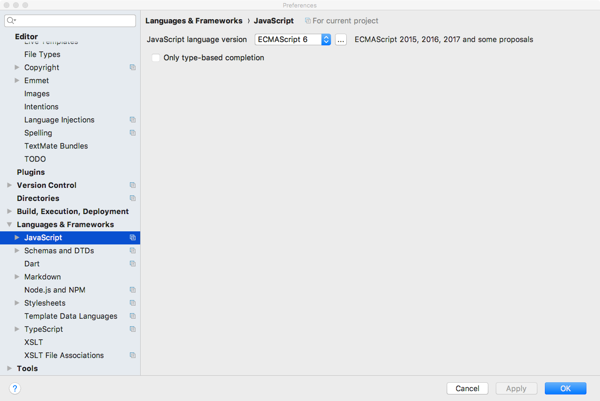
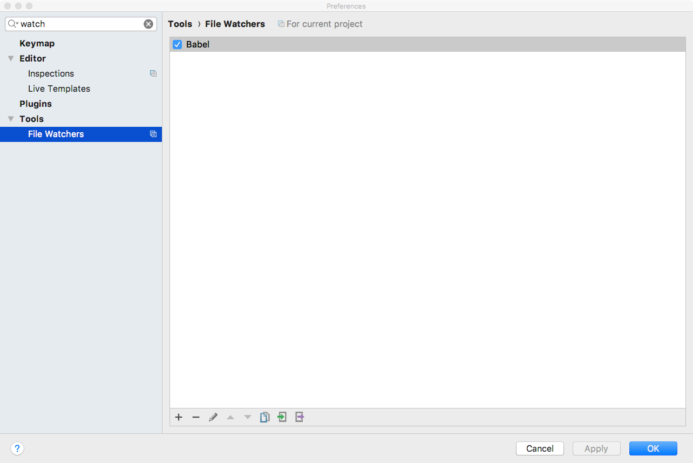
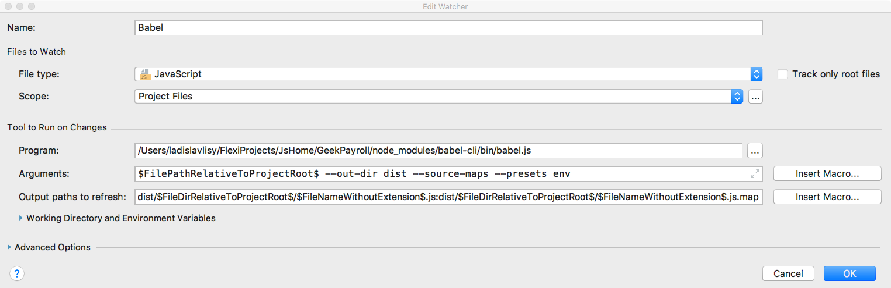
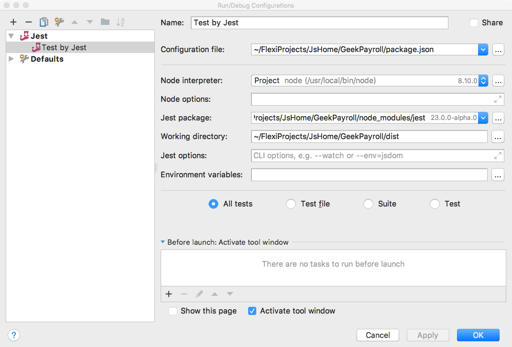

# Project Bootstrap
### npm dependencies (terminal)
    npm install --save-dev babel-cli babel-preset-env
    npm install --save-dev enumify
    npm install --save-dev jest
    npm install --save-dev babel-jest
    npm install --save-dev babel-core
    npm install --save-dev regenerator-runtime

### Config Webstorm Preferences

### Config Webstorm Task
